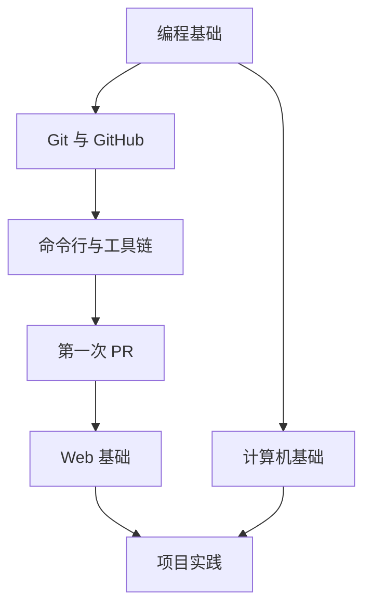

# 学习路径总览

本站把新手学习拆成 6 条路线：

1. 编程基础；
2. 计算机基础；
3. Git 与 GitHub；
4. 命令行与工具链；
5. Web 基础；
6. 项目实践。

## 推荐顺序

## 重要原则

### 不要等全部学完才开始贡献

开源入门最有效的方式是：边学边做小贡献。

### 不要把资源越收越多

每个阶段只保留少量高质量资源。资源应该有明确用途。

### 不要一开始就挑战复杂项目

新手的第一个任务最好满足：

- 30 分钟到 2 小时能完成；
- 修改范围小；
- 不需要理解完整代码库；
- Review 标准清晰。
