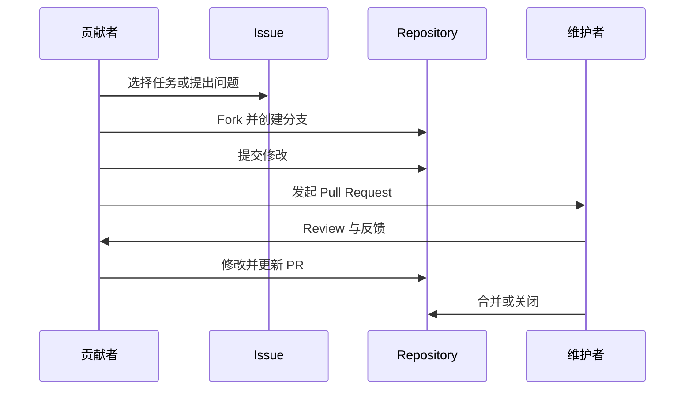

# 开源如何协作

一个开源项目通常由维护者、贡献者、使用者和社区参与者共同推动。

## 典型角色

| 角色 | 主要职责 |
|---|---|
| 维护者 | 管理方向、Review PR、处理 Issue、制定规范。 |
| 贡献者 | 提交代码、文档、资源、测试或设计改进。 |
| 使用者 | 使用项目、反馈问题、提出需求。 |
| 组织者 | 组织活动、学习小组、Workshop 和复盘。 |

## 协作流程

## 新手常见误区

### 误区一：必须会很多技术才能参与

不是。文档、翻译、资源整理、步骤验证都很适合新手。

### 误区二：PR 越大越好

不是。新手的第一个 PR 应该小而清晰，维护者更容易 Review。

### 误区三：被要求修改就是失败

不是。Review 是协作的一部分，被指出问题并完成修改，才是完整的贡献体验。
